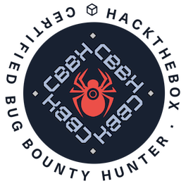

<h1 align="center">hey, i'm gerbsec</h1>
<h3 align="center">security n stuff</h3>

- anything and everything offsec with a lil bit of purple

- founder and team captain of [protosec](https://twitter.com/protos3c)

#### Socials:
- [twitter](https://twitter.com/gerbsec)
- [website](https://gerbsec.com)

### 🏅 Certifications and Achievements

### 🖥️ Languages and Tools

 

